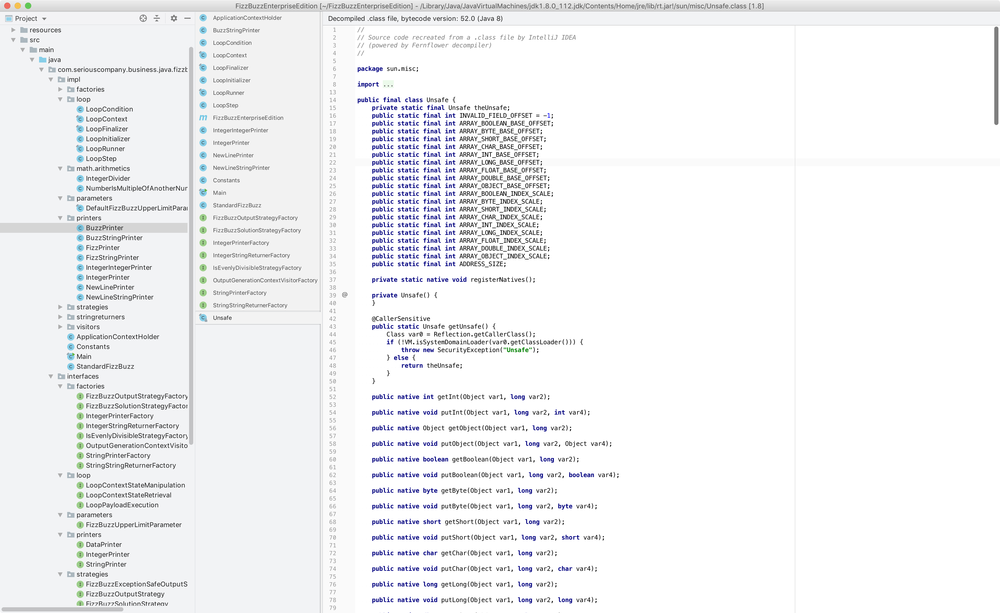
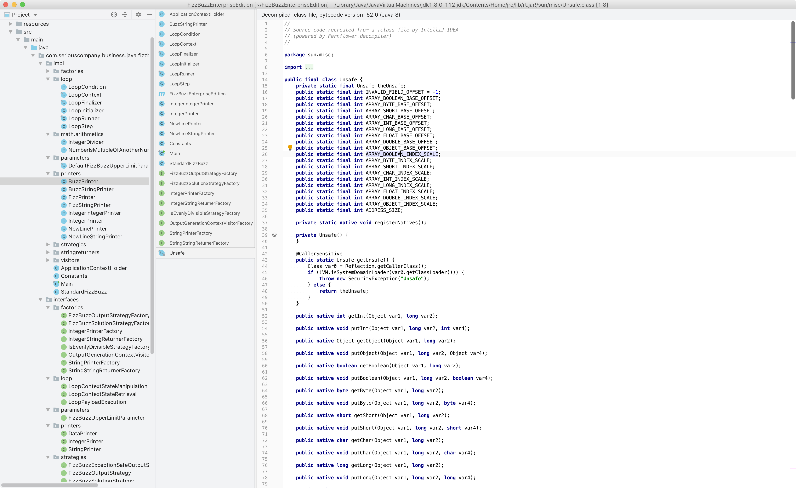
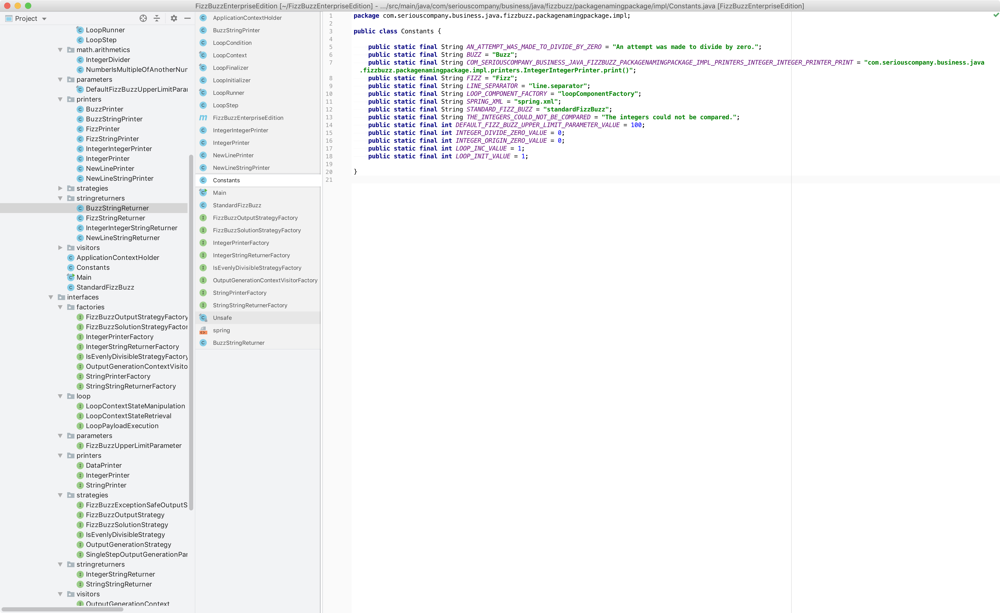

A low-contrast light theme with an Eiffel-like text color scheme.
    
For IntelliJ version 2019.1 and above.

To install this, go to `Preferences | Plugins`, click the gear, and select "install plugin from disk." After restarting, select the theme from `Preferences | Appearance and Behavior | Appearance | Theme`. Select "Brian's Grey Eiffel" from `Preferences | Editor | Color Scheme | Scheme`.
  
Please note that this theme overrides your font settings. If you want to retain your old font settings, uncheck "Use color scheme font instead of the default" in `Preferences | Editor | Color Scheme | Color Scheme Font`.

  
  
